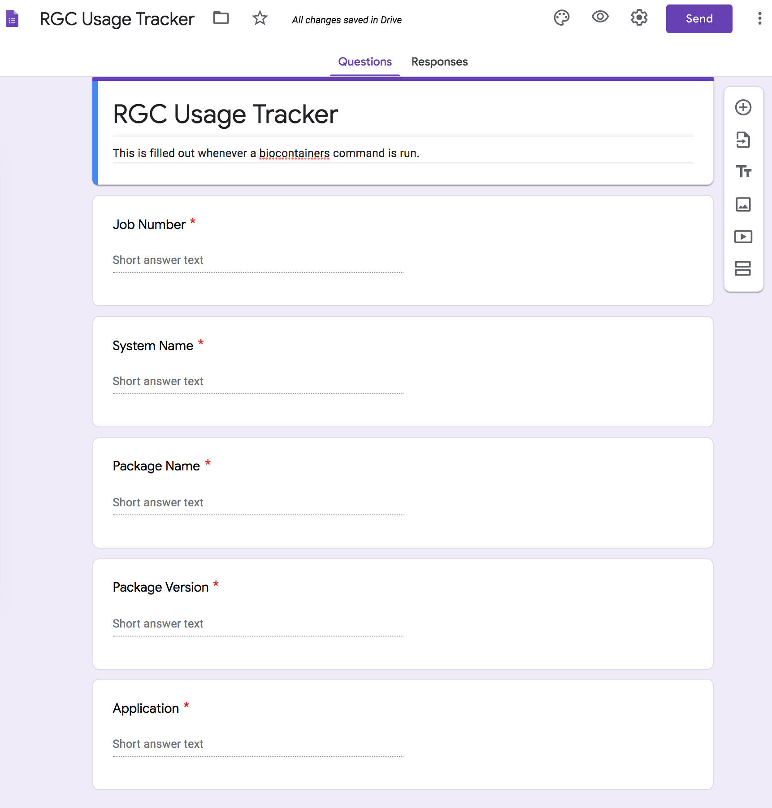
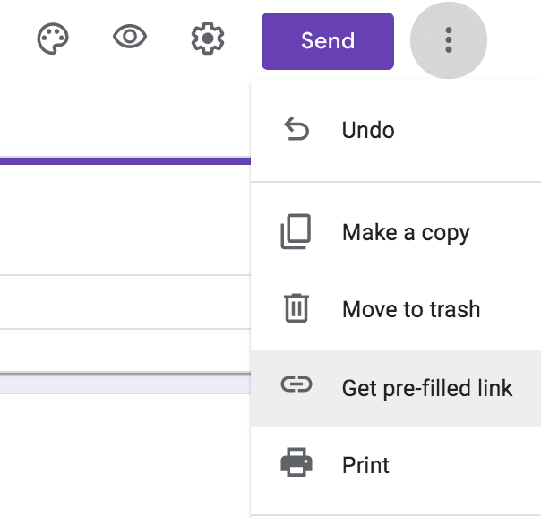
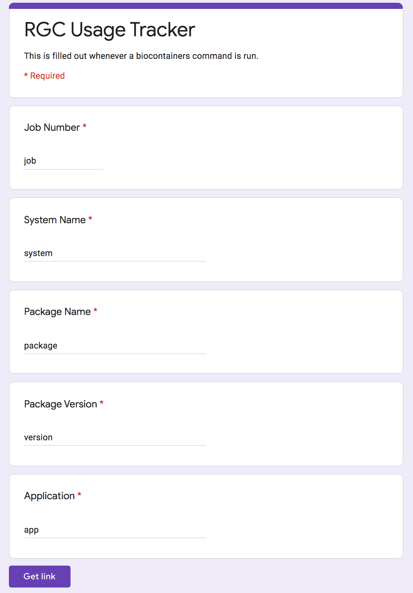

Usage metrics can be tracked externally via Google Forms.

## 1. Create a Google Form

Create a form that contains the information you would like to track.
In my case, I was interested in:

- Job Number - To group usage by individual jobs
- System Name - To track usage trends by system
- Package Name - The actual package being used
- Package Version - The version of the package
- Application - The application being invoked

Remember that this is a publicly accessible link, so I recommend making all fields required to help prevent anyone from overloading it.



## 2. Get an example link

Choose the option to get a "pre-filled link" from the dropdown on the right.



Each of the fields has a randomly generated ID, so fill each input with a descriptive value. 



Click "Get link" to create an option to copy the custom link, with input values, to your clipboard.

```
https://docs.google.com/forms/d/e/[formID]/viewform?usp=pp_url&entry.28814888=job&entry.10439454=system&entry.26481495=package&entry.75025244=version&entry.202310978=app
```

Any time this URL is visited, these values will be added as a response to your form.
The actual values can be replaced to enable custom responses via curl.
